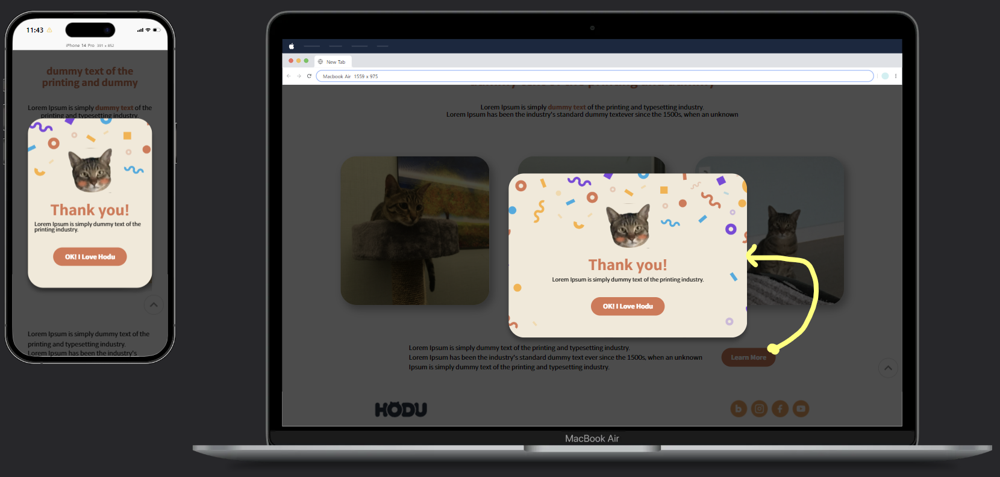

# hodu-repo
> **프로젝트의 중점&목표**
> 1. 시멘틱한 태그를 사용하여 마크업 할 것
> 2. 피그마 디자인을 최대한 반영할 것
> 3. 반응형으로 대응 가능할 것
> 4. 웹 접근성을 점검할 것

***
## 폴더 구조 ##

```
프로젝트/
│
├── index.html         - 메인 HTML 파일
├── style.css          - 스타일시트
├── reset.css          - CSS 리셋(import됨)
├── modal.html         - 모달창을 따로 구현하고 index에 추가
└── img/               - 이미지 파일 디렉토리
    ├── bedghodu.svg
    ├── boxhodu.svg
    ├── logo_fin.spg
    └── ...
```

## 구현 내용 ##
1. **메인 레이아웃**
  - 헤더/메인/푸터/스크롤 버튼(aside)/모달(dialog)로 구성
2. **Subscribe 버튼 작용**
- input 
  ```
3. **반응형 구현**


## 프로젝트 회고 ##
편의성을 위해 KPT 회고법을 사용하였습니다.
1. **Keep:계속할 것**
   - CSS Flex를 이용하여 피그마 디자인을 적용
   - 미디어 쿼리를 통한 반응형 구현
   - 모달 창이 뜰 때 오버레이 배경을 추가하여 시각적 편의성을 높임
    <br>
2. **Problem:아쉬운 점**
   - 프로젝트 미완성
   - 검색 엔진 최적화 과정을 거치지 않음
   - 시간 분배 문제
   - div(빈 태그)를 남용함
   - 거의 모든 레이아웃에 flex를 적용>남용?
   - 웹 브라우저에서 모달창이 뜰 때 위치가 오른쪽으로 쏠림
   - 헤더 고정 미적용
   - 모바일 햄버거 버튼 미적용
   - 800px~600px 사이 구간에서 반응형 디자인이 깨짐
    <br>
4. **Try:시도해 볼 점**
   - 프로젝트 미완성 -> 완성 후 LLM 등을 이용해서 리뷰 받아보기
   - 검색 엔진 최적화 과정을 거치지 않음 -> 검색 엔진 최적화 계획을 다시 세우고 적용할 것
   - 시간 분배 문제 -> 프로젝트의 로드맵을 스스로 설정하도록 습관 개선
   - div(빈 태그)를 남용함 -> 시멘틱 태그의 종류를 파악하고 인지할 수 있게 공부가 필요함
   - 거의 모든 레이아웃에 flex를 적용>남용? -> 다른 레이아웃 방식(grid) 탐구하기
   - 웹 브라우저에서 모달창이 뜰 때 위치가 오른쪽으로 쏠림 -> 위치 조정
   - 헤더 고정 미적용 -> 추후 적용할 것
   - 모바일 햄버거 버튼 미적용 -> 추구 적용할 것
   - 800px~600px 사이 구간에서 반응형 디자인이 깨짐 -> 반응형 코드 재검토
<br>
<br>
*이 페이지의 이미지 저작권은 (주)위니브에 있습니다*
